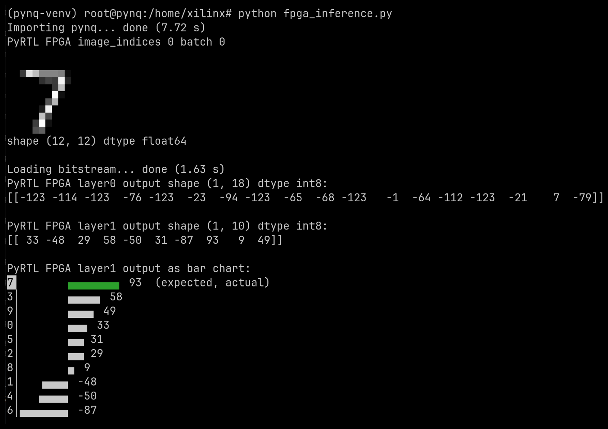

`pyrtlnet` FPGA
===============

Documentation for running `pyrtlnet` inference on a
[Pynq Z2 FPGA](https://www.amd.com/en/corporate/university-program/aup-boards/pynq-z2.html).

### Requirements

A
[Pynq Z2 FPGA](https://www.amd.com/en/corporate/university-program/aup-boards/pynq-z2.html)
is required. With some modifications, these instructions may work with
other FPGAs, but these instructions have only been tested with a Pynq Z2.

The scripts in this directory currently expect to be run on Linux. These
scripts have only been tested on Ubuntu 25.04.

### About the Pynq Z2

The Pynq Z2 has an unusual architecture. It is effectively a single-board
computer, like a
[Raspberry Pi](https://www.raspberrypi.com/), with an attached FPGA. The board
has a hardware ARM core, which boots Linux from a SD card, and some onboard
DDR3 memory. It connects to a network via Ethernet. Users typically interact
with the board over the network, usually by opening a Jupyter Notebook or
`ssh`ing to the board. This hardware ARM core running Linux is called the
Processing System. In the Pynq documentation, the Processing System is usually
abbreviated as "PS". The attached FPGA is called the Programmable Logic,
usually abbreviated as "PL" in Pynq documentation.

The FPGA is typically accessed from this Processing System, instead of accessing
the FPGA directly from a host computer. So to deploy a bitstream on the Z2, we
first build the bitstream on a host computer with
[Vivado](https://www.amd.com/en/products/software/adaptive-socs-and-fpgas/vivado.html),
then copy the bitstream to Processing System over the network, with `scp` for
example. Then we instruct the Processing System to load the bitstream on the
FPGA, with the
[`pynq.Overlay`](https://pynq.readthedocs.io/en/latest/pynq_overlays/loading_an_overlay.html)
Python library.

Keep this architecture in mind as you read through these instructions. Some
commands are run on the host computer, while others are run on the Pynq Z2's
Processing System, which can be confusing. In these instructions, host computer
commands will look like this:

```shell
$ echo "This is running on the host computer (where you run Vivado)."
```

While commands running on the Pynq Z2's Processing System will look like this:

```shell
xilinx@pynq:~$ echo "This is running on the Pynq Z2 as the `xilinx` user."

root@pynq:/home/xilinx# echo "This is running on the Pynq Z2 as `root`."
```

### Pynq Z2 Set Up

Follow the
[Pynq Z2 Setup Guide](https://pynq.readthedocs.io/en/latest/getting_started/pynq_z2_setup.html)
to configure and boot the Pynq Z2. These
instructions were tested with SD card image v3.1.1.

Verify that you can
[connect to the board's Jupyter Notebook](https://pynq.readthedocs.io/en/latest/getting_started/pynq_z2_setup.html#connecting-to-jupyter-notebook).

Verify that you can `ssh` to the board:
```shell
$ ssh xilinx@pynq
...
Welcome to PYNQ Linux, based on Ubuntu 22.04 (GNU/Linux 6.6.10-xilinx-v2024.1-g3c0eca68c652 armv7l)
...
xilinx@pynq:~$ exit
logout
Connection to pynq closed.
$
```

Verify that you can
[connect to the Serial Console](https://pynq.readthedocs.io/en/latest/getting_started/pynq_z2_setup.html#opening-a-usb-serial-terminal).
This is not strictly necessary, but very useful for debugging, especially if
you are having trouble connecting the Pynq Z2 to your network.

### Install Vivado

[Install Vivado](https://www.xilinx.com/support/download/index.html/content/xilinx/en/downloadNav/vivado-design-tools.html).
Use the version
[recommended for your SD card image](https://pynq.readthedocs.io/en/latest/pynq_sd_card.html#use-an-existing-ubuntu-os).
These instructions were tested with SD card image v3.1 and Vivado 2024.1.

Ensure that `vivado` is on your `$PATH`:

```shell
$ vivado -version
vivado v2024.1 (64-bit)
Tool Version Limit: 2024.05
SW Build 5076996 on Wed May 22 18:36:09 MDT 2024
IP Build 5075265 on Wed May 22 21:45:21 MDT 2024
SharedData Build 5076995 on Wed May 22 18:29:18 MDT 2024
Copyright 1986-2022 Xilinx, Inc. All Rights Reserved.
Copyright 2022-2024 Advanced Micro Devices, Inc. All Rights Reserved.
```

### Generate Verilog

Generate Verilog for the AXI version of the `pyrtlnet` inference hardware with:

```shell
$ make pyrtl_inference_axi.v
```

If successful, you should see a generated Verilog file named `pyrtl_inference_axi.v`:

```shell
$ head pyrtl_inference_axi.v
// Generated automatically via PyRTL
// As one initial test of synthesis, map to FPGA with:
//   yosys -p "synth_xilinx -top toplevel" thisfile.v

module toplevel(clk, s0_axi_araddr, s0_axi_aresetn, s0_axi_arvalid, s0_axi_awaddr, s0_axi_awvalid, s0_axi_bready, s0_axi_clk, s0_axi_rready, s0_axi_wdata, s0_axi_wstrb, s0_axi_wvalid, s0_axis_aclk, s0_axis_aresetn, s0_axis_tdata, s0_axis_tlast, s0_axis_tvalid, argmax, s0_axi_arready, s0_axi_awready, s0_axi_bresp, s0_axi_bvalid, s0_axi_rdata, s0_axi_rresp, s0_axi_rvalid, s0_axi_wready, s0_axis_tready, valid);
    input clk;
    input[6:0] s0_axi_araddr;
    input s0_axi_aresetn;
    input s0_axi_arvalid;
    input[6:0] s0_axi_awaddr;
```

The module should have many `axi` inputs and outputs.

### Generate bitstream and hardware handoff file

Generate a bitstream and hardware handoff file from `pyrtl_inference_axi.v`:

```shell
$ make pyrtlnet.bit pyrtlnet.hwh
```

This step runs Vivado on the
[`pyrtlnet_ip.tcl`](https://github.com/UCSBarchlab/pyrtlnet/blob/main/fpga/pyrtlnet_ip.tcl)
and
[`pyrtlnet_pynq.tcl`](https://github.com/UCSBarchlab/pyrtlnet/blob/main/fpga/pyrtlnet_pynq.tcl)
scripts.
This takes some time, about 5 minutes on my computer.

The
[`pyrtlnet_ip.tcl`](https://github.com/UCSBarchlab/pyrtlnet/blob/main/fpga/pyrtlnet_ip.tcl)
script just packages `pyrtl_inference_axi.v` in a new `pyrtlnet` IP block.

The
[`pyrtlnet_pynq.tcl`](https://github.com/UCSBarchlab/pyrtlnet/blob/main/fpga/pyrtlnet_pynq.tcl)
script instantiates the new `pyrtlnet` IP block, connects it to the Zynq
Processing System via AXI, and generates a bitstream.

When successful, this step generates a bitstream file named `pyrtlnet.bit`, and
a hardware handoff file named `pyrtlnet.hwh`:

```shell
$ ls -l pyrtlnet.bit pyrtlnet.hwh
-rw-rw-r-- 1 lauj lauj 4045676 Oct 27 10:57 pyrtlnet.bit
-rw-rw-r-- 1 lauj lauj  281520 Oct 27 10:57 pyrtlnet.hwh
```

> [!NOTE]
> This step implicitly runs `make pyrtl_inference_axi.v` from the previous
> step, so the previous step is not strictly necessary. For your first time, we
> recommend running the previous step explicitly anyway, to understand where
> problems occur.

### Deploy assets to the Pynq Z2's Processing System

Many assets are required to run `pyrtlnet` on the Pynq Z2:

1. The generated bitstream (`pyrtlnet.bit`)
1. The generated hardware handoff file (`pyrtlnet.hwh`)
1. The FPGA driver script ([`fpga_inference.py`](https://github.com/UCSBarchlab/pyrtlnet/blob/main/fpga/fpga_inference.py))
1. `pyrtlnet` Python libraries ([`pyrtlnet/`](https://github.com/UCSBarchlab/pyrtlnet/tree/main/pyrtlnet))
1. Trained quantized neural network weights (`quantized.npz`)
1. MNIST test data (`mnist_test_data.npz`)

Run `make deploy` to copy all these assets to the Pynq Z2, using
[rsync](https://rsync.samba.org/) over `ssh`:

```shell
$ make deploy
...
sending incremental file list
mnist_test_data.npz
pyrtlnet.bit
pyrtlnet.hwh
fpga_inference.py
quantized.npz
pyrtlnet/
pyrtlnet/__init__.py
pyrtlnet/inference_util.py
pyrtlnet/litert_inference.py
pyrtlnet/mnist_util.py
pyrtlnet/numpy_inference.py
pyrtlnet/pyrtl_axi.py
pyrtlnet/pyrtl_inference.py
pyrtlnet/pyrtl_matrix.py
pyrtlnet/tensorflow_training.py
pyrtlnet/training_util.py
pyrtlnet/wire_matrix_2d.py

sent 5,725,817 bytes  received 332 bytes  1,272,477.56 bytes/sec
total size is 5,723,218  speedup is 1.00
```

### Prepare the Pynq Z2's Processing System

`ssh` to the Pynq Z2:

```shell
$ ssh xilinx@pynq
...
Welcome to PYNQ Linux, based on Ubuntu 22.04 (GNU/Linux 6.6.10-xilinx-v2024.1-gb36799f4e960 armv7l)

Last login: Fri Oct 24 21:58:37 2025
xilinx@pynq:~$
```

[Activate the `pynq` virtual environment](https://discuss.pynq.io/t/run-python-scripts-in-pynq-environment/7761/2):

```shell
xilinx@pynq:~$ sudo bash
[sudo] password for xilinx:
root@pynq:/home/xilinx# . /etc/profile.d/pynq_venv.sh
(pynq-venv) root@pynq:/home/xilinx# . /etc/profile.d/xrt_setup.sh
(pynq-venv) root@pynq:/home/xilinx#
```

This lets us use Pynq from the command line, rather than using the slower
Jupyter Notebook interface.

Install `pyrtl` on the Pynq Z2:

```shell
(pynq-venv) root@pynq:/home/xilinx# pip install pyrtl
...
Successfully installed pyrtl-1.0.3
```

> [!NOTE]
> [`fpga_inference.py`](https://github.com/UCSBarchlab/pyrtlnet/blob/main/fpga/fpga_inference.py)
> requires `pyrtl` only for
> [`pyrtl.infer_val_and_bitwidth`](https://pyrtl.readthedocs.io/en/latest/helpers.html#pyrtl.infer_val_and_bitwidth),
> and
> [`pyrtl.val_to_signed_integer`](https://pyrtl.readthedocs.io/en/latest/helpers.html#pyrtl.val_to_signed_integer),
> to reinterpret signed integers as raw bits to send to the FPGA, and to
> reinterpret the raw bits received from the FPGA as signed integers. This
> dependency on `pyrtl` could be removed by reimplementing these functions.

### Run `pyrtlnet` FPGA Inference

Run the
[`fpga_inference.py`](https://github.com/UCSBarchlab/pyrtlnet/blob/main/fpga/fpga_inference.py)
driver script on the Pynq Z2, which:
1. Loads the `pynq` runtime environment
1. Copies the `pyrtlnet` bitstream to the FPGA
1. Loads the MNIST test image in a
   [Pynq `Buffer`](https://pynq.readthedocs.io/en/latest/pynq_libraries/allocate.html#allocate)
1. Transmits the `Buffer` to the FPGA via
   [AXI DMA](https://discuss.pynq.io/t/tutorial-pynq-dma-part-1-hardware-design/3133)
1. Retrieves the inference results via AXI

```shell
(pynq-venv) root@pynq:/home/xilinx# python fpga_inference.py
```



The tensors output by this script should exactly match the tensors output by
[`pyrtl_inference.py`](https://github.com/UCSBarchlab/pyrtlnet/blob/main/pyrtl_inference.py)

Other test images can be run on the FPGA by setting
[`fpga_inference.py`](https://github.com/UCSBarchlab/pyrtlnet/blob/main/fpga/fpga_inference.py)'s
`--start_image` flag.

### Modifying The Design

The
[`pyrtlnet_pynq.tcl`](https://github.com/UCSBarchlab/pyrtlnet/blob/main/fpga/pyrtlnet_pynq.tcl)
build script creates a Vivado project file named
`fpga/pyrtlnet_pynq/pyrtlnet_pynq.xpr`. This project file can be opened and
modified in the Vivado GUI. For example, you could connect the `pyrtlnet` IP
block's `argmax` output to the board's LEDs, to have the board display the most
likely digit, in binary.

Most of the design is in the `pyrtlnet` IP block. The rest of the Vivado block
design just connects the `pyrtlnet` IP block to the Zynq Processing System, via
AXI.

The `pyrtlnet` IP block is just a wrapper around `pyrtl_inference_axi.v`, which
is Verilog code generated by PyRTL
([`pyrtl_inference.py --axi --verilog`](https://github.com/UCSBarchlab/pyrtlnet/blob/main/pyrtl_inference.py)).
Instead of modifying the generated Verilog code directly, it's better to modify
the PyRTL code itself, then regenerate the Verilog code. The provided
[`Makefile`](https://github.com/UCSBarchlab/pyrtlnet/blob/main/fpga/Makefile)
automates the process of regenerating the Verilog code, building a new
bitstream, and deploying it to the Pynq Z2.
